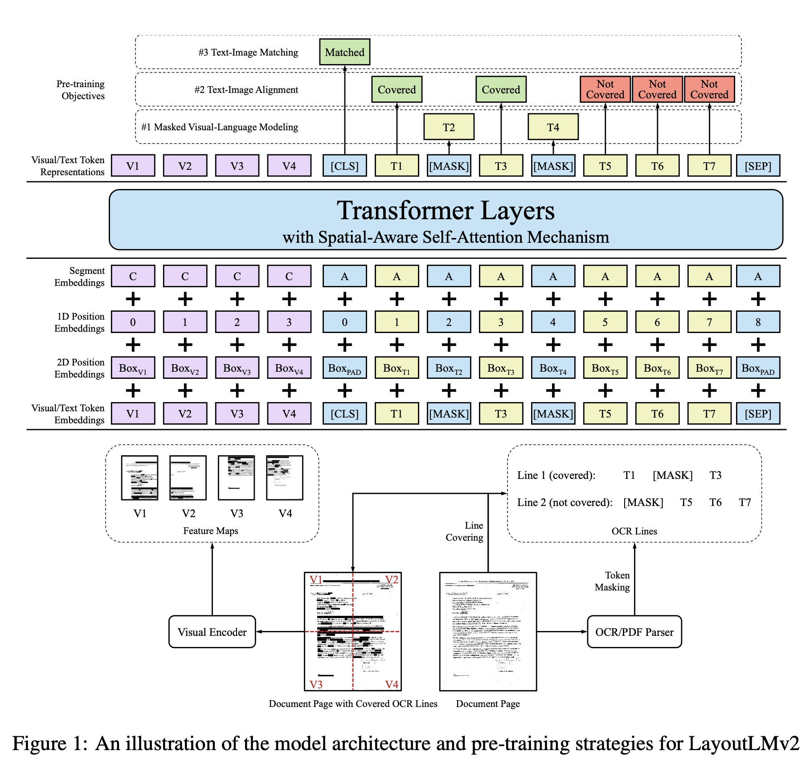
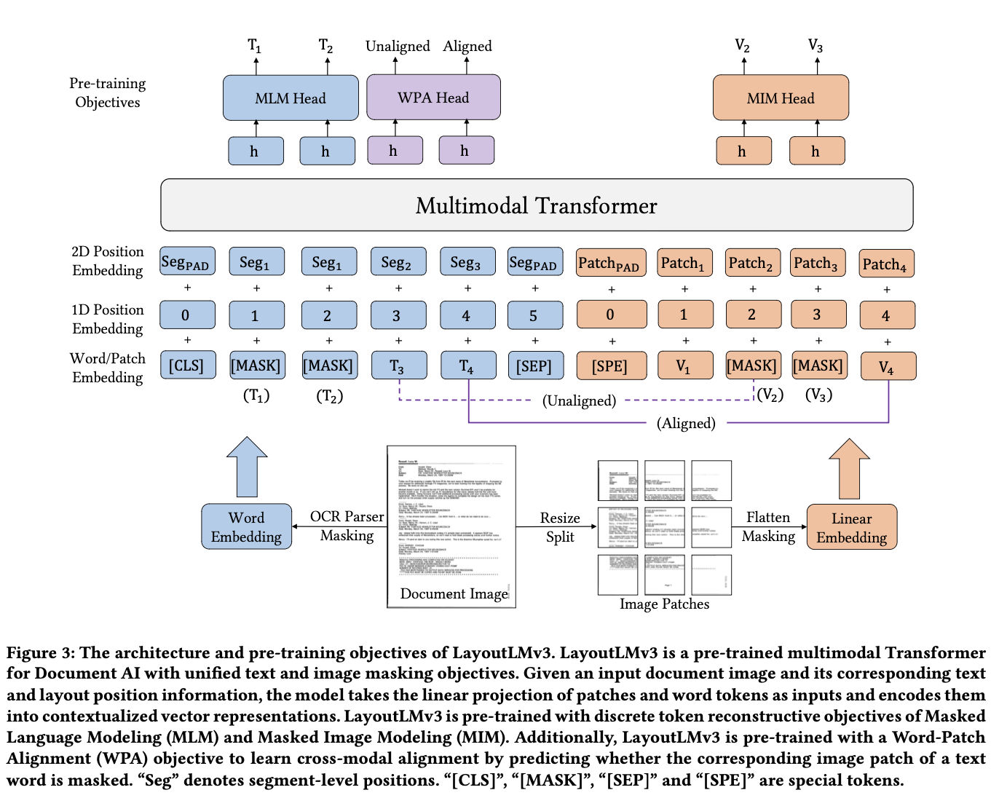
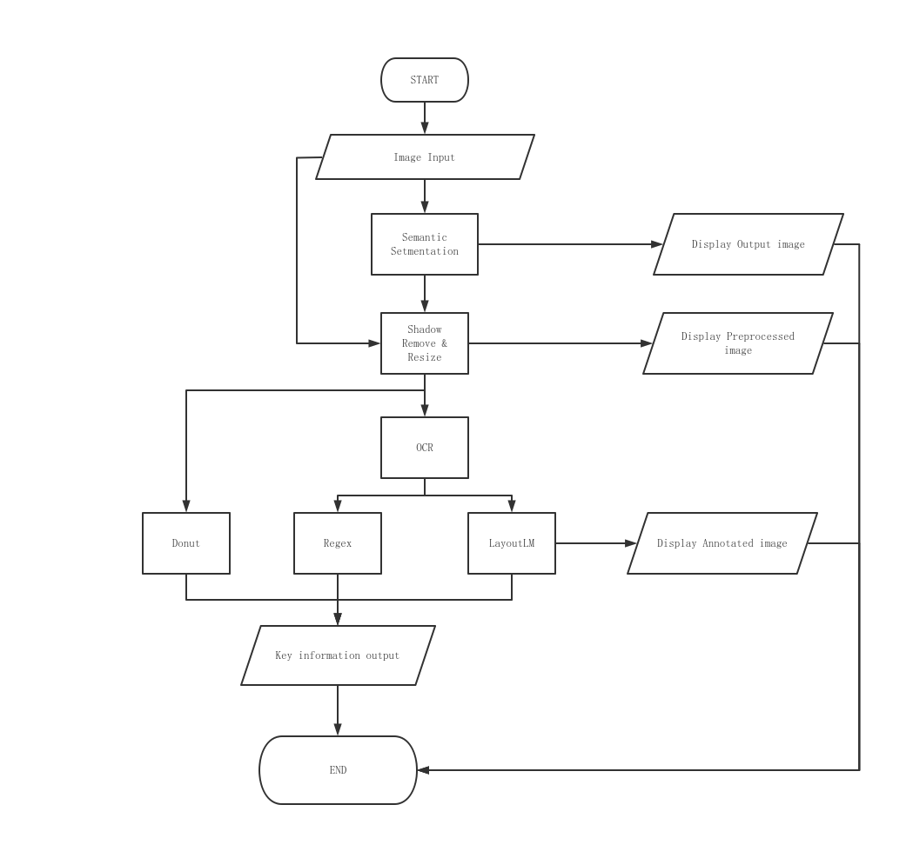
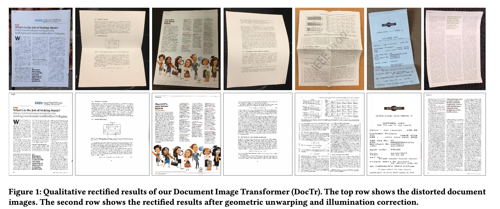

# Final project: Real-time Receipt Recognition

Author: Jiaen LIU 8/1/2023

Co-worker: Ivan STEPANIAN

Repository Link: https://github.com/JiaenLiu123/final_project

## Introduction

This repository contains the final project for JiaenLiu's Bachelor's degree in Computer Science at the Beijing Institute of Petrochemical Technology and International Master Project for EFREI Paris. The project is a web app that can recognize receipt in real time and extract the information from the receipt. In this project, two CNNs are applied for semantic segmentation of receipt, tesseract for OCR and Regex and LayoutLM models family for key information extraction. All of these parts will be introduced in the following sections.

## Background

With the background of digital transformation, people want to digitalize existing data such as invoices, and recipts. These files are semi-structured. They have a general structure like the receipts, they have the address, telephone number, name of the shop in the top of the receipt, details of items in the middle of the receipt and total amount, details of tax and date in the end of the receipt. Obviously, there is some important structure information inside of the receipt. Instead of just getting the text from receipt, we want a step more, getting all key information inside of one receipt. In this part, I will discuss all the steps before Key Information Extractions of receipts and organize them in sub-tasks format. I will discuss the model I choosed in next section.

- Receipt Localization

  Receipt localization, or more generally, document localization, is defined as the problem of finding a Tetragon contour from an image that can be classified as target document.  Generally speaking, this problem is very complex. If you just consider a very simple case, only a whole flat receipt inside of one image with decent contrast with backgroud, traditional machine learning can handle that case. But if you consider more cases such as some parts of the receipt are missing and the receipts are twisted, folded and so on, which all of these are very common in our daily life. Traditional methods are not robust enough to solve these cases. Deep learning based solutions are much more flexible and reliable in these cases. Also, document unwarping can be also applied in this task in order to remove wrinkles and other artifacts. 

- Optical Character Recognition

  Optical Character Recognition refers to convert any images with textual content to only text inside of this image, such as scanned printings, images of handwritings and photoed documents. There are two main steps in OCR, text detection and text recognition. Text detection's job is to localize all text in the image with bounding box, then text recognition will try to convert all text content within the bounding boxs into machine readable text. For this project, 


## My approach

- Part 1: **Detect and Segment the receipt in the image**

    In this part, I followed a tutorial offered by LearnOpenCv. It shows how to use convolutional neural networks to detect one receipt inside of one image which the receipt can be twisted, unclosed, and even some parts are missing. Two models are used in this part, mobileNetv3 and ResNet-50, due to the limitation of machines, I do not manage to fine-tune the resnet-50 futher, instead, I fine-tune mobileNetv3 on on our new dataset generated from Findit T1 (Number of Training set: 5391/ Number of Test set: 1079). The best Intersection over Union(IoU) is 0.973 and Loss is 0.072 on test set. The reason why I use this model to detect the receipt is robustness. At the beginning, I try to use traditional machine learning algorithms to find the edge of the receipts and based on that detected edges to locate the receipt. But this approach failed in many cases, such as the receipt is unclosed, twisted, low constract with the background and so on. With the help of CNNs, these problems are solved. But CNNs also have their own limitation and I will discuss it in Need to be improved section.

- Part 2: **Resize the receipt and remove the shadow**

    To be honest, I think this part is very important for the next part. Because image quality is very vital for the Optical Character Recognition (OCR) and Name Entity Recognition. There is no one size fits all solution for that. Due to the time limitation, I use some traditional methods for this part, image resizing and shadows removing. Also, there are a lot of works can be done in this part such as image quality assessment and image quality improvement. I will discuss this in detail in Need to be improvede section.

- Part 3: **OCR and Key Information Extraction**

    This part is the most important part of my project, and it is also the most time consuming part. There are two tasks, OCR and Key Information Extraction. The OCR part is relatively easy, I choose to use tesseract OCRv5 in my project with the configuration OCR engine modes 2 and Page segmentation modes 12. Idealy, I want to deploy a transformer-based model layoutLMv3 to extract all key information inside of one receipt such as date, total amout, address, company name, name of items, price of items and tax information. But to achieve that, the tasks are too much to be done within two months. Instead, I select date and total amount as my goals in this time. 

    With my co-worker, we create two approaches for this task. First approach is based on regular expression, depending on format, location, currency sign and so on. A navie weighted mechanism is applied in this approach to check every word in the OCR output whether it is the date or the total amount of the receipt. I use this regex script to label findit Task 1 dataset (500 images). The accuracy of this script is 0.72.

    For the second approach, I partly managed to use a transformer-based model layoutLMv3 to extract the date and total amount from the receipt. In this approach, I use a pre-trained model from Theivaprakasham which is fine-tuned on SOIRE dataset. I try to extend his work and fine tune his model on Findit dataset. But I failed to achieve that. I put a lot work to label the findit dataset and convert it into the format that layoutLMv3 required and it is not finished yet. Also, I add a function to get key-value pair format output from the model. But this function is not stable and the length of words I get from the tokenizer is not equal to the length of non-subwords predictions. I try to solve it but I failed to do that. There is no resources from Internet about this bug. Due to that, I can not test the accuracy of this model based on it's text output. 

    My own understanding of the model:

    At the beginning, I start to use layoutLMv2 as the main algorithms for the key information extraction. This model will leverage the information from 3 aspects, token embedding, visual embedding and layout embedding. For the token embedding, there are three parts in it, word embedding and segment embedding from WordPiece and 1D positional embedding to represent the token index. Visual embedding is generated from a CNN-based visual encoder, however, since CNN can not extract the positional information, a 1D positional embedding and segment embedding are added. For layout embedding, the spatial layout information is respented by axis-aligned token bounding boxes from the OCR results. 
    
    
    Then I find that this model has a new version, layoutLMv3 and then I switch to the new model. There are two main modifications in the new model. First, layoutLMv3 change the ways of layout embedding, instead of using word-level layout positions, new model uses segment-level layout positions. The authors think that words in a segmnet share the same 2D position since the words usually express the shame semantic meaning. Second, for the image embedding, inspired by ViT and ViLT, layoutLMv3 uses linear projection features of image patches to represent the  document images and then fitting these embeddings into multimodal Transformer. To be honest, I do not have a deep understanding about that, I am not familiar with Vision Transformers. But I think this will reduce the computation and region supervision is not required anymore. And from the numbers given in the paper, new model beats the old one and the parameters are much less than previous model. 
    

Flowchat of whole application:
    


## Need to be improved
1. The improvement of image preprocessing (Unwarp the image)

  As I mentioned before, CNNs can detect and segment the receipt when the receipt is twisted and unclosed. But when they cannot unwarp the image back to flat. This can be done by DocUNet and DocTr. These models are desigened to unwarp the image back to its original state. I want to apply these methods in my project. But the cost of computation is too much to accept it. In future, I want to intergrate image unwarping into this project with a efficient way.



2. Image Quality Assessment & Image Quality Improvement

  Image Quality is very important for the OCR and KIE. So I think if I can improve the image quality of input images, the accuracy of the regex and layoutLM will be improved a lot due to a better OCR output. Also, this can be one important factor of our model. If the input quality is bad and model does not extract the information from receipt, that is OK. But if the input quality is good and model also does not extract the information, that is unacceptable. But the image quality is a very subject matrix, that's why I need a stable IQA algorithm to do it instead of doing it manually. I hope I can add this in future to make the project be more accurate and convincing.

3. Full information extraction

  As I discribed before, my goal is to create a tool that can extract all useful information from one receipt. I think if I manage to fine tune the model on my new dataset of date and total amount. I can apply this procedure to other information. I need more time to do that and I need to fully understand about this model, how it works and why it works. There are still a lot of jobs to do in this part. 

## Installation

Idealy, you need a machine in Ubuntu 18.04 to run this project. There is no GPU requirement. You can also run it in Windows by Windows Subsystem For Linux, that is due to detectron2 is not officially supported on Windows. You need to install tesseract OCR engine manually. The following packages are required to run this project:

```bash
# First download all codes from this repository
git clone https://github.com/JiaenLiu123/final_project
cd final_project

# Make sure you have install gcc ≥ 5.4 and g++ ≥ 5.4, detectron2 requires them to compile the C++ code.
# If you don't have them, you can install them by:
sudo apt update
sudo apt install gcc g++

# optional, create a virtual environment by conda
conda create -n final_project python=3.8
conda activate final_project
# if you need gpu acceleration, you can install pytorch and torchvision by:
conda install pytorch torchvision torchaudio pytorch-cuda=11.6 -c pytorch -c nvidia
# if you don't need gpu acceleration, you can just uncomment torch and torchvision in requirements.txt and install them.

# Install the required packages
python -m pip install -r requirements.txt
python -m pip install 'git+https://github.com/facebookresearch/detectron2.git'
python -m pip install torchvision tesseract

# For Ubuntu to install Tesseract 5
sudo apt update
sudo add-apt-repository ppa:alex-p/tesseract-ocr-devel
sudo apt install -y tesseract-ocr
sudo apt update 
# Check the version is correct (Should be the latest version)
tesseract --version、

# Add the language data for Tesseract 5
# Use the following command to check the available languages and path to the language data
tesseract --list-langs
# Download the language data
wget https://github.com/tesseract-ocr/tessdata/blob/main/fra.traineddata
# if wget cannot work, you can download it from the link and put it in the correct path
# Be careful to make sure the fra.traineddata and eng.traineddata are correct

# After successfully install all dependencies, you can just run following command to use the streamlit web application. For the first run, it takes some time to download models from Internet.
streamlit run cleaned_app.py

```

## Thanks
This project is based on the following projects:  
https://learnopencv.com/deep-learning-based-document-segmentation-using-semantic-segmentation-deeplabv3-on-custom-dataset/  
https://huggingface.co/spaces/Theivaprakasham/layoutlmv2_sroie  

Datasets:

Findit:

https://drive.google.com/file/d/1fPOTGQS_wX0xCABrmk87OnWCr0rEE-Cx/view?usp=share_link

https://drive.google.com/file/d/1Zog-6cY35vuJcJ24I6ZCKR57zEXqyrNB/view?usp=share_link

https://drive.google.com/file/d/1GzCYqEqOTk2YRLUQemyOBV0TURB2RyPD/view?usp=share_link

SORIE:

https://drive.google.com/drive/folders/1xvZ6jpZQfpMHJCUD0L_5KHQy0T9QAepx?usp=share_link

https://drive.google.com/drive/folders/11lDpn-rO3AmmyIMCYxYizZnP6BPgETsy?usp=share_link

Important papers:

Ylisiurunen, Markus. "Extracting Semi-Structured Information from Receipts." (2022).

Feng, Hao, et al. "Doctr: Document image transformer for geometric unwarping and illumination correction." *arXiv preprint arXiv:2110.12942* (2021).

Huang, Yupan, et al. "LayoutLMv3: Pre-training for Document AI with Unified Text and Image Masking." *arXiv preprint arXiv:2204.08387* (2022).

Artaud, Chloé, et al. "Receipt Dataset for Fraud Detection." *First International Workshop on Computational Document Forensics*. 2017.

Howard, Andrew, et al. "Searching for mobilenetv3." *Proceedings of the IEEE/CVF international conference on computer vision*. 2019.

Ma, Ke, et al. "Docunet: Document image unwarping via a stacked u-net." *Proceedings of the IEEE conference on computer vision and pattern recognition*. 2018.